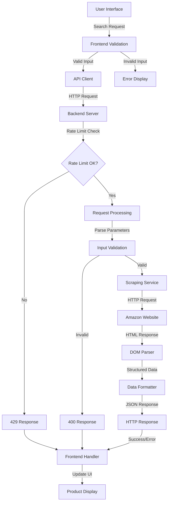

# System Architecture Overview

## 📋 Architecture Summary

The Amazon Product Scraper is a full-stack web application built using a modern, microservices-oriented architecture. The system is designed for scalability, maintainability, and performance, leveraging contemporary JavaScript runtimes and frameworks.

### High-Level Architecture

```
┌─────────────────────────────────────────────────────────────────┐
│                        CLIENT LAYER                             │
├─────────────────────────────────────────────────────────────────┤
│  Web Browsers  │  Mobile Apps  │  API Clients  │  Third-party   │
│                │               │               │  Integrations  │
└─────────────────────────────────────────────────────────────────┘
                              │
                              ▼
┌─────────────────────────────────────────────────────────────────┐
│                    PRESENTATION LAYER                           │
├─────────────────────────────────────────────────────────────────┤
│                     Frontend Application                        │
│  ┌─────────────────┬─────────────────┬─────────────────────────┐│
│  │   Vite Server   │   Static Assets │   Progressive Web App  ││
│  │   (Dev Mode)    │   (Production)  │     (Optional)          ││
│  └─────────────────┴─────────────────┴─────────────────────────┘│
│  Technologies: HTML5, CSS3, JavaScript ES6+, Tailwind CSS     │
└─────────────────────────────────────────────────────────────────┘
                              │
                              ▼
┌─────────────────────────────────────────────────────────────────┐
│                      API GATEWAY LAYER                          │
├─────────────────────────────────────────────────────────────────┤
│                    RESTful API Server                           │
│  ┌─────────────────┬─────────────────┬─────────────────────────┐│
│  │  Rate Limiting  │      CORS       │    Error Handling       ││
│  │  & Security     │   Configuration │    & Validation         ││
│  └─────────────────┴─────────────────┴─────────────────────────┘│
│  Technologies: Express.js, Bun Runtime, Middleware Stack       │
└─────────────────────────────────────────────────────────────────┘
                              │
                              ▼
┌─────────────────────────────────────────────────────────────────┐
│                     BUSINESS LOGIC LAYER                        │
├─────────────────────────────────────────────────────────────────┤
│                    Scraping Engine Core                         │
│  ┌─────────────────┬─────────────────┬─────────────────────────┐│
│  │  Web Scraping   │  Data Parsing   │   Multi-domain Support ││
│  │   Controller    │   & Validation  │    & URL Generation     ││
│  └─────────────────┴─────────────────┴─────────────────────────┘│
│  Technologies: Axios, JSDOM, Custom Parsers                    │
└─────────────────────────────────────────────────────────────────┘
                              │
                              ▼
┌─────────────────────────────────────────────────────────────────┐
│                      DATA ACCESS LAYER                          │
├─────────────────────────────────────────────────────────────────┤
│                   External Data Sources                         │
│  ┌─────────────────┬─────────────────┬─────────────────────────┐│
│  │  Amazon.com     │  Amazon.co.uk   │   Other Amazon          ││
│  │                 │                 │   Regional Sites        ││
│  └─────────────────┴─────────────────┴─────────────────────────┘│
│  Technologies: HTTP Client, DOM Parsing, CSS Selectors         │
└─────────────────────────────────────────────────────────────────┘
```

---

## 🏗️ Component Architecture

### Frontend Architecture

#### Component Structure

```
frontend/
├── index.html              # Entry point
├── main.js                 # Application bootstrap
├── i18n.js                # Internationalization setup
├── src/
│   ├── components/         # Reusable UI components
│   │   ├── autocomplete.js # Search suggestions
│   │   ├── product-card.*  # Product display components
│   │   └── utilities.*     # Helper utilities
│   ├── styles/             # CSS modules and themes
│   │   ├── components.css  # Component-specific styles
│   │   ├── mobile-first.css# Responsive design
│   │   └── theme.css       # Design system variables
│   ├── utils/              # Client-side utilities
│   │   ├── api.js          # API client wrapper
│   │   ├── validation.js   # Form validation
│   │   └── storage.js      # Local storage manager
│   └── test/               # Frontend tests
├── locales/                # Translation files
│   ├── en.json             # English translations
│   ├── pt.json             # Portuguese translations
│   └── es.json             # Spanish translations
├── dist/                   # Production build output
└── config/                 # Build and dev configurations
    ├── vite.config.js      # Vite bundler config
    ├── tailwind.config.js  # CSS framework config
    └── postcss.config.js   # CSS post-processing
```

#### Data Flow Architecture

```
User Interaction
        │
        ▼
┌─────────────────┐    ┌──────────────────┐    ┌─────────────────┐
│   UI Component  │────│  Event Handler   │────│  API Client     │
│   (Search Form) │    │  (Search Submit) │    │  (HTTP Request) │
└─────────────────┘    └──────────────────┘    └─────────────────┘
        │                       │                       │
        ▼                       ▼                       ▼
┌─────────────────┐    ┌──────────────────┐    ┌─────────────────┐
│ State Manager   │    │  Validation      │    │  Loading State  │
│ (Local State)   │    │  (Client-side)   │    │  (UI Feedback)  │
└─────────────────┘    └──────────────────┘    └─────────────────┘
        │                       │                       │
        ▼                       ▼                       ▼
┌─────────────────┐    ┌──────────────────┐    ┌─────────────────┐
│ Response Data   │────│  Data Transform  │────│  UI Rendering   │
│ (Product List)  │    │  (Format/Filter) │    │  (Product Grid) │
└─────────────────┘    └──────────────────┘    └─────────────────┘
```

### Backend Architecture

#### Service Layer Structure

```
backend/
├── server.js               # Application entry point
├── config/                 # Configuration management
│   ├── domains.js          # Amazon domain configurations
│   ├── selectors.js        # CSS selector strategies
│   └── constants.js        # Application constants
├── controllers/            # Request handlers
│   ├── scrapeController.js # Product scraping logic
│   ├── healthController.js # Health check endpoints
│   └── domainController.js # Domain management
├── services/               # Business logic layer
│   ├── scraperService.js   # Core scraping service
│   ├── parserService.js    # HTML/DOM parsing service
│   ├── validatorService.js # Request validation
│   └── cacheService.js     # Caching layer (optional)
├── middleware/             # Express middleware
│   ├── rateLimiter.js      # Rate limiting
│   ├── errorHandler.js     # Global error handling
│   ├── corsConfig.js       # CORS configuration
│   └── requestLogger.js    # Request logging
├── utils/                  # Utility functions
│   ├── userAgents.js       # User agent rotation
│   ├── retryLogic.js       # Retry mechanisms
│   └── urlBuilder.js       # URL construction helpers
└── tests/                  # Backend tests
    ├── unit/               # Unit tests
    ├── integration/        # Integration tests
    └── fixtures/           # Test data
```

#### Request Processing Pipeline

```
HTTP Request
     │
     ▼
┌─────────────────┐    ┌──────────────────┐    ┌─────────────────┐
│  CORS Middleware│────│  Rate Limiter    │────│  Request Logger │
│  (Origin Check) │    │  (IP-based)      │    │  (Debug Info)   │
└─────────────────┘    └──────────────────┘    └─────────────────┘
     │                           │                       │
     ▼                           ▼                       ▼
┌─────────────────┐    ┌──────────────────┐    ┌─────────────────┐
│  Input Validator│────│  Controller      │────│  Service Layer  │
│  (Params Check) │    │  (Route Handler) │    │  (Business Logic)│
└─────────────────┘    └──────────────────┘    └─────────────────┘
     │                           │                       │
     ▼                           ▼                       ▼
┌─────────────────┐    ┌──────────────────┐    ┌─────────────────┐
│  Web Scraping   │────│  Data Parsing    │────│  Response Format│
│  (HTTP Request) │    │  (DOM Analysis)  │    │  (JSON Output)  │
└─────────────────┘    └──────────────────┘    └─────────────────┘
     │                           │                       │
     ▼                           ▼                       ▼
┌─────────────────┐    ┌──────────────────┐    ┌─────────────────┐
│  Error Handling │────│  Retry Logic     │────│  HTTP Response  │
│  (Try/Catch)    │    │  (Exponential)   │    │  (Client Return)│
└─────────────────┘    └──────────────────┘    └─────────────────┘
```

---

## 🔧 Technology Stack

### Frontend Technologies

| Layer | Technology | Version | Purpose |
|-------|------------|---------|---------|
| **Runtime** | Bun | v1.0+ | JavaScript runtime and package manager |
| **Build Tool** | Vite | v5.0+ | Fast development server and bundler |
| **Styling** | Tailwind CSS | v3.4+ | Utility-first CSS framework |
| **JavaScript** | ES6+ | Latest | Modern JavaScript features |
| **Internationalization** | i18next | v25+ | Multi-language support |
| **Testing** | Vitest | v3.2+ | Unit testing framework |
| **Post-processing** | PostCSS | v8.5+ | CSS transformation |

### Backend Technologies

| Layer | Technology | Version | Purpose |
|-------|------------|---------|---------|
| **Runtime** | Node.js/Bun | v18+/v1.0+ | Server runtime environment |
| **Framework** | Express.js | v4.18+ | Web application framework |
| **HTTP Client** | Axios | v1.6+ | HTTP request library |
| **DOM Parsing** | JSDOM | v23+ | Server-side DOM manipulation |
| **CORS** | cors | v2.8+ | Cross-origin resource sharing |
| **Testing** | Jest/Supertest | v29+/v7+ | Testing framework and HTTP assertions |

### Development & Build Tools

| Category | Technology | Purpose |
|----------|------------|---------|
| **Package Management** | Bun/npm | Dependency management |
| **Version Control** | Git | Source code management |
| **Code Quality** | ESLint | JavaScript linting |
| **Documentation** | Markdown | Project documentation |
| **Configuration** | JSON/JS | Application configuration |

---

## 🔄 Data Flow Architecture

### Request Flow Diagram



### Data Processing Pipeline

```
Raw HTML Input
       │
       ▼
┌─────────────────┐    ┌──────────────────┐    ┌─────────────────┐
│   HTML Parsing  │────│  Element Select  │────│  Text Extract   │
│   (JSDOM Load)  │    │  (CSS Selectors) │    │  (Clean/Trim)   │
└─────────────────┘    └──────────────────┘    └─────────────────┘
       │                       │                       │
       ▼                       ▼                       ▼
┌─────────────────┐    ┌──────────────────┐    ┌─────────────────┐
│  Data Mapping   │────│   Validation     │────│   Formatting    │
│  (Field Match)  │    │  (Required Fields)│    │  (Price/Rating) │
└─────────────────┘    └──────────────────┘    └─────────────────┘
       │                       │                       │
       ▼                       ▼                       ▼
┌─────────────────┐    ┌──────────────────┐    ┌─────────────────┐
│  URL Generation │────│  Object Creation │────│  JSON Response  │
│  (Product Links)│    │  (Product Schema)│    │  (Client Return)│
└─────────────────┘    └──────────────────┘    └─────────────────┘
```

---

## 🗄️ Data Models

### Product Data Schema

```typescript
interface Product {
  id: string;                    // Amazon ASIN or generated ID
  title: string;                 // Product title
  price: string;                 // Current price with currency symbol
  originalPrice?: string;        // Original price if discounted
  discount?: string;             // Discount percentage
  rating: string;                // Average rating (1-5 stars)
  reviews: string;               // Number of reviews
  prime: boolean;                // Amazon Prime eligible
  imageUrl: string;              // Product image URL
  productUrl: string;            // Direct Amazon product link
  availability: string;          // Stock status
  shippingInfo: string;          // Shipping information
  brand?: string;                // Product brand
  category?: string;             // Product category
  extractedAt: Date;             // Data extraction timestamp
  domain: string;                // Amazon domain source
}
```

### API Response Schema

```typescript
interface APIResponse {
  success: boolean;              // Operation success status
  timestamp: string;             // Response timestamp (ISO 8601)
  keyword?: string;              // Search keyword used
  domain?: string;               // Amazon domain searched
  totalProducts?: number;        // Number of products found
  processingTime?: string;       // Time taken to process
  products?: Product[];          // Array of product objects
  error?: string;                // Error message (if failed)
  code?: string;                 // Error code (if failed)
  pagination?: PaginationInfo;   // Pagination metadata
}

interface PaginationInfo {
  currentPage: number;           // Current page number
  totalPages: number;            // Total pages available
  hasNextPage: boolean;          // More pages available
  hasPreviousPage: boolean;      // Previous pages exist
  totalProducts: number;         // Total products across all pages
  productsPerPage: number;       // Products per page limit
}
```

### Configuration Schema

```typescript
interface DomainConfig {
  name: string;                  // Display name
  baseUrl: string;               // Base Amazon URL
  currency: string;              // Default currency code
  language: string;              // Accept-Language header value
  region: string;                // Geographic region
  selectors: SelectorConfig;     // CSS selectors for parsing
}

interface SelectorConfig {
  productContainer: string[];    // Product container selectors
  title: string[];               // Title element selectors
  price: string[];               // Price element selectors
  rating: string[];              // Rating element selectors
  reviews: string[];             // Review count selectors
  image: string[];               // Image element selectors
  link: string[];                // Product link selectors
}
```

---

## 🔒 Security Architecture

### Security Layers

```
┌─────────────────────────────────────────────────────────────────┐
│                        SECURITY LAYERS                          │
├─────────────────────────────────────────────────────────────────┤
│  Layer 1: Network Security                                      │
│  ┌─────────────────┬─────────────────┬─────────────────────────┐│
│  │   CORS Policy   │   Rate Limiting │    Request Validation   ││
│  │   (Origin Check)│   (IP-based)    │    (Input Sanitization) ││
│  └─────────────────┴─────────────────┴─────────────────────────┘│
│                                                                 │
│  Layer 2: Application Security                                  │
│  ┌─────────────────┬─────────────────┬─────────────────────────┐│
│  │  Error Handling │  User Agent     │    Request Headers      ││
│  │  (Info Disclosure)│ Rotation      │    (Security Headers)   ││
│  └─────────────────┴─────────────────┴─────────────────────────┘│
│                                                                 │
│  Layer 3: Data Security                                         │
│  ┌─────────────────┬─────────────────┬─────────────────────────┐│
│  │  Input Encoding │  Output Encoding│    Memory Management    ││
│  │  (XSS Prevention)│ (Safe Responses)│   (Resource Cleanup)   ││
│  └─────────────────┴─────────────────┴─────────────────────────┘│
└─────────────────────────────────────────────────────────────────┘
```

### Rate Limiting Strategy

```typescript
interface RateLimitConfig {
  windowMs: number;              // Time window in milliseconds
  max: number;                   // Maximum requests per window
  skipSuccessfulRequests: boolean; // Count only failed requests
  skipFailedRequests: boolean;   // Count only successful requests
  keyGenerator: (req) => string; // Custom key generation
  handler: (req, res) => void;   // Custom handler for limit exceeded
  onLimitReached: (req, res) => void; // Callback when limit reached
}
```

---

## ⚡ Performance Architecture

### Performance Optimization Strategies

#### Frontend Performance

1. **Code Splitting**
   ```javascript
   // Dynamic imports for large dependencies
   const i18next = await import('i18next');
   const detector = await import('i18next-browser-languagedetector');
   ```

2. **Asset Optimization**
   ```javascript
   // Vite configuration for production
   export default {
     build: {
       rollupOptions: {
         output: {
           manualChunks: {
             vendor: ['i18next', 'i18next-browser-languagedetector']
           }
         }
       },
       minify: 'esbuild',
       cssMinify: true
     }
   }
   ```

3. **Caching Strategy**
   ```javascript
   // Service Worker for caching (optional)
   if ('serviceWorker' in navigator) {
     navigator.serviceWorker.register('/sw.js');
   }
   ```

#### Backend Performance

1. **Request Optimization**
   ```javascript
   // Connection pooling and keep-alive
   const axiosConfig = {
     timeout: 10000,
     keepAlive: true,
     maxSockets: 10
   };
   ```

2. **Memory Management**
   ```javascript
   // Cleanup DOM references
   const cleanupDOM = () => {
     dom.window.close();
     dom = null;
   };
   ```

3. **Concurrent Processing**
   ```javascript
   // Process multiple requests concurrently
   const results = await Promise.allSettled(
     products.map(parseProduct)
   );
   ```

### Monitoring & Metrics

```typescript
interface PerformanceMetrics {
  requestCount: number;          // Total requests processed
  averageResponseTime: number;   // Average response time in ms
  errorRate: number;             // Error rate percentage
  memoryUsage: {                 // Memory usage statistics
    used: number;                // Used memory in MB
    total: number;               // Total available memory
    percentage: number;          // Usage percentage
  };
  cacheHitRate: number;          // Cache hit rate percentage
  uptime: number;                // Server uptime in seconds
}
```

---

## 🔧 Configuration Management

### Environment-Based Configuration

```typescript
interface EnvironmentConfig {
  development: {
    port: number;
    cors: string[];
    debug: boolean;
    rateLimiting: RateLimitConfig;
  };
  production: {
    port: number;
    cors: string[];
    debug: boolean;
    rateLimiting: RateLimitConfig;
    ssl: SSLConfig;
  };
  test: {
    port: number;
    mockData: boolean;
    testTimeout: number;
  };
}
```

### Feature Flags

```typescript
interface FeatureFlags {
  enableCaching: boolean;        // Enable response caching
  enableMetrics: boolean;        // Enable performance metrics
  enableDebugLogging: boolean;   // Enable debug logging
  enableRateLimiting: boolean;   // Enable rate limiting
  enableCORS: boolean;           // Enable CORS middleware
  multiDomainSupport: boolean;   // Enable multiple Amazon domains
}
```

---

## 🚀 Deployment Architecture

### Development Environment

```
Developer Machine
├── Frontend Dev Server (Vite)  → http://localhost:5173
├── Backend Dev Server (Bun)    → http://localhost:3000
├── Hot Module Replacement      → Instant updates
└── Development Tools           → Debugging, Testing
```

### Production Environment

```
Production Server
├── Frontend (Static Files)     → CDN/Web Server
├── Backend (API Server)        → Application Server
├── Reverse Proxy (nginx)       → Load Balancing
├── SSL Termination             → HTTPS
└── Monitoring & Logging        → Performance Tracking
```

### Scalability Considerations

1. **Horizontal Scaling**
   - Multiple backend instances
   - Load balancer distribution
   - Session-less design

2. **Vertical Scaling**
   - CPU optimization
   - Memory management
   - I/O optimization

3. **Caching Layers**
   - In-memory caching
   - Redis for distributed caching
   - CDN for static assets

---

## 📊 Error Handling Architecture

### Error Classification

```typescript
enum ErrorType {
  VALIDATION_ERROR = 'VALIDATION_ERROR',      // Invalid input parameters
  RATE_LIMIT_ERROR = 'RATE_LIMIT_ERROR',     // Too many requests
  SCRAPING_ERROR = 'SCRAPING_ERROR',         // Amazon scraping failed
  NETWORK_ERROR = 'NETWORK_ERROR',           // Network connectivity issues
  PARSING_ERROR = 'PARSING_ERROR',           // HTML parsing failed
  INTERNAL_ERROR = 'INTERNAL_ERROR'          // Unexpected server errors
}

interface APIError {
  type: ErrorType;
  message: string;
  code: string;
  statusCode: number;
  timestamp: Date;
  requestId: string;
  details?: any;
}
```

### Error Recovery Strategies

1. **Retry Logic**: Exponential backoff for transient errors
2. **Graceful Degradation**: Partial results when some data fails
3. **Circuit Breaker**: Prevent cascading failures
4. **Fallback Mechanisms**: Alternative data sources or cached responses

---

## 🧪 Testing Architecture

### Testing Strategy

```
Testing Pyramid
├── Unit Tests (70%)
│   ├── Component logic testing
│   ├── Service layer testing
│   └── Utility function testing
├── Integration Tests (20%)
│   ├── API endpoint testing
│   ├── Database integration testing
│   └── External service testing
└── End-to-End Tests (10%)
    ├── User workflow testing
    ├── Cross-browser testing
    └── Performance testing
```

### Test Environment Architecture

```typescript
interface TestConfiguration {
  unit: {
    framework: 'vitest' | 'jest';
    coverage: {
      threshold: number;
      reporters: string[];
    };
  };
  integration: {
    mockServices: boolean;
    testDatabase: string;
  };
  e2e: {
    browsers: string[];
    viewport: { width: number; height: number }[];
  };
}
```

---

This architecture overview provides a comprehensive understanding of the Amazon Product Scraper system design, covering all major architectural decisions, technology choices, and implementation patterns used throughout the application.

*For detailed implementation guides, see the [Contributing Guide](contributing.md). For deployment architecture details, see the [Deployment Guide](../guides/deployment.md).*
